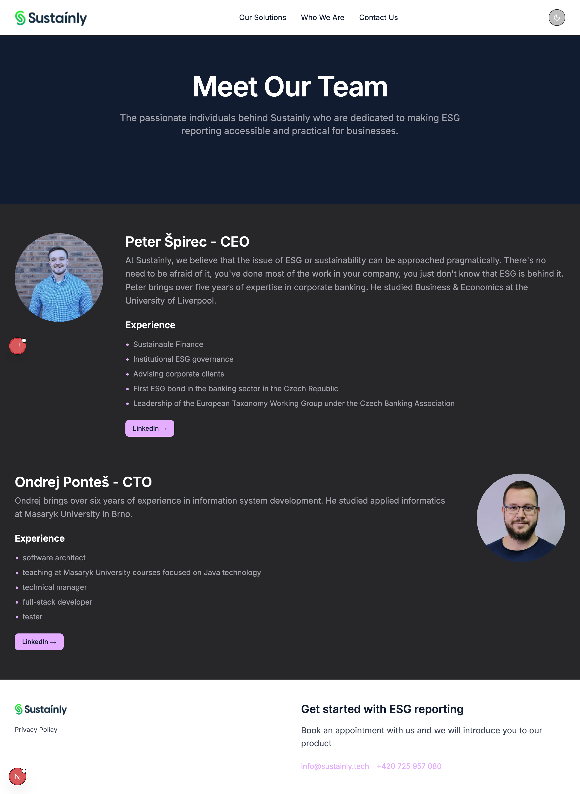

# Sustainly - Take-Home Task

## Screenshots
- Landing Page in Dark Theme

- Landing Page in Light Theme

- Team Page in Dark Theme

- Team Page in Light Theme

## 📱 Pages
- **Landing Page**: Hero section with ESG reporting solutions showcase
- **Team Page**: Meet the team with detailed member profiles and experience
- **Solutions Section**: Display of three main services (ESG Report, Sustainability Strategy, Carbon Footprint)
- **Contact Form**: Get in touch section with form validation

## 🧩 Key Components

- **ThemeToggle**: Dropdown menu for theme selection
- **SolutionCard**: Reusable cards for services display
- **ContactForm**: Form with validation
- **Header/Footer**: Navigation and site information
- **ThemeAwareLogo**: Logo that adapts to current theme

## 🎨 Theme System
- **Light Theme**: Clean, bright interface for daytime use
- **Dark Theme**: Easy-on-the-eyes dark mode for low-light environments
- **System Theme**: Automatically follows the user's system preference
- **Persistent Theme**: Remembers user's theme choice across sessions

## 🎨 Theme Implementation

The theme system supports three modes:

1. **Light**: Default bright theme
2. **Dark**: Dark mode with proper contrast
3. **System**: Automatically detects and follows OS preference

Theme switching is handled by a custom React context provider with:
- Local storage persistence
- System preference detection
- Smooth transitions between themes
- SSR-safe hydration

## 📱 Responsive Design

The application is fully responsive with breakpoints:
- Mobile: 320px+
- Tablet: 768px+
- Desktop: 1024px+
- Large screens: 1280px+

